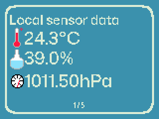
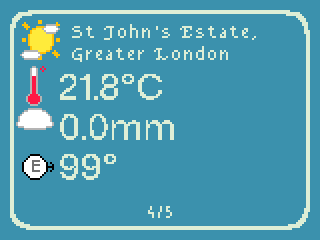

# Weatherstation

**Weatherstation** is an app for the Badgeware Tufty that shows information either from a multisensor stick or the internet through Openmeteo. It runs fully on the badge, you just need to configure it on your computer and you're set.

## Screenshots

  
   
  <em>Local sensor data</em>
   
  
   
  <em>Weather data from the internet</em>

## How it works

Its a Micropython app for the Badgeware Tufty 2350. That means you don't need to reflash firmware or anything to run the app, and it can run alongside other Micropython apps like the pre-installed ones.

It uses two online APIs:

- **OpenStreetMap Nominatim** - This is for geocoding coordinates into place names
- **Openmeteo** - This actually gets the weather data for places set

Both do not require API keys.

The code loads options from `options.json`, currently only for which unit of measurement temperature should use (either Celsius, Fahrenheit or Kelvin) and for location coordinates. You can set several locations, and optionally set nicknames to override the names OSM Nominatim generates.

## How to install

Follow the guide at [the weatherstation website](https://weatherstation.nouxinf.net/install.html) for a step-by-step tutorial on how to isntall and configure weatherstation on real hardware. If you don't have a Tufty you can try it out at the [demo page](https://weatherstation.nouxinf.net/).

You can find the source code for the badgeware simulator fork [here](https://github.com/nouxinf/weatherstation-simulator)

## Attribution

Jerry Gamblin/jgamblin made the original version of `screenshot.py` which is licensed under the Apache License version 2.0. Extra modifications were added to it.

### AI usage

I used AI to get me started with using the multisensor strip and for general debugging. I also used it to modify screenshot.py to have better windows support and add some extra options.
